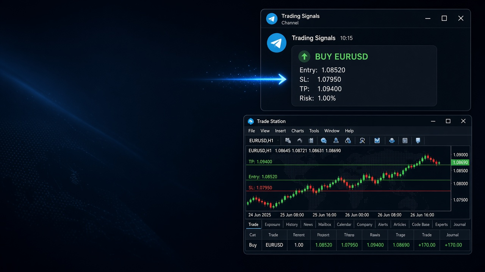
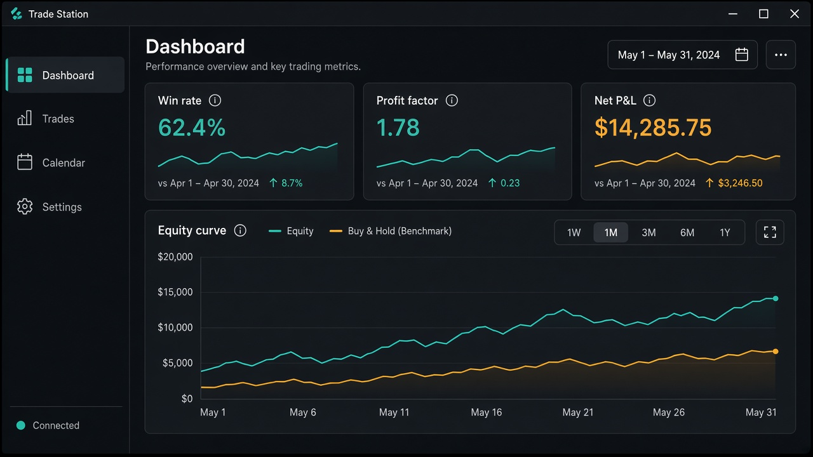
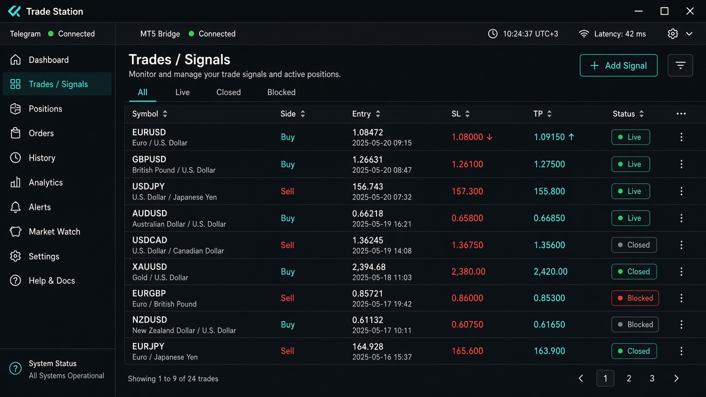
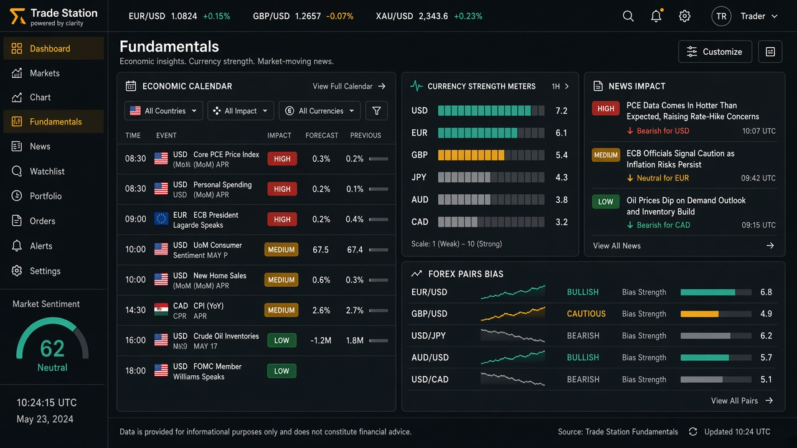
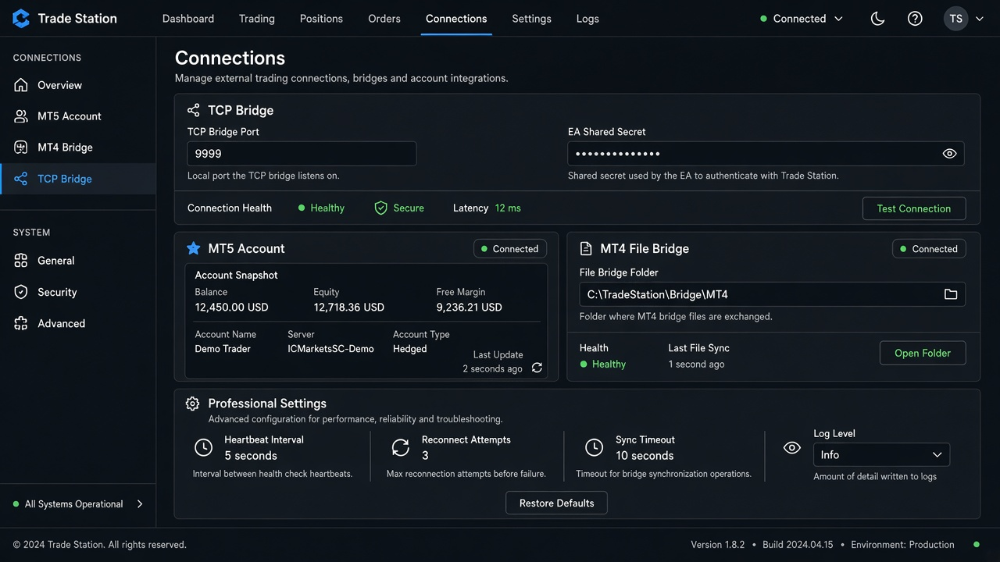
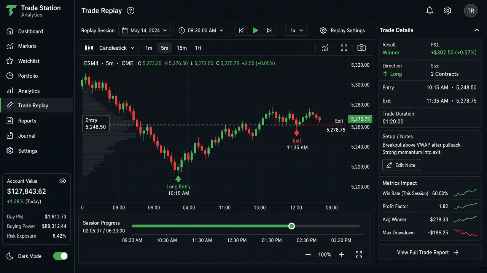
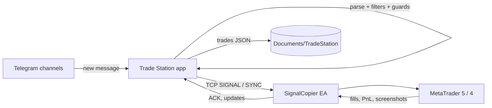

<p align="center">
  
</p>

<h1 align="center">Trade Station</h1>

<p align="center">
  <strong>Copy Telegram trading signals to MetaTrader 5 &amp; 4 — with analytics, fundamentals, and risk controls built in.</strong>
</p>

<p align="center">
  
  
  
  
</p>

<p align="center">
  
</p>

---

## Overview

**Trade Station** is a desktop app (Electron + React) that sits between **Telegram signal channels** and your **MetaTrader** terminal. It parses incoming messages, applies your filters and guards, then sends structured orders to the **SignalCopier EA** over a local TCP bridge. Trades, screenshots, and account snapshots stay on your machine under `Documents\TradeStation\`.

No license key or cloud account is required for the open-source build.

| You get | Details |
|--------|---------|
| **Live execution** | MT5 primary (MT4 via EA + optional file bridge) |
| **Per-account history** | JSON trade store, backup/restore ZIP |
| **Real fundamentals** | Live feeds only — unavailable data shows **N/A**, never fake quotes |
| **Simple vs Advanced UI** | Hide power tools until you need them |

---

## Screenshots

<table>
  <tr>
    <td width="50%">
      <a href="docs/screenshots/dashboard.png"></a><br/>
      <sub><b>Dashboard</b> — KPIs, equity curve, calendar heatmap, account scope</sub>
    </td>
    <td width="50%">
      <a href="docs/screenshots/signals.png"></a><br/>
      <sub><b>Trades</b> — All / Live / Closed / Blocked, execution monitor, resend &amp; journal</sub>
    </td>
  </tr>
  <tr>
    <td>
      <a href="docs/screenshots/fundamentals.png"></a><br/>
      <sub><b>Fundamentals</b> — Calendar, strength, sentiment, news guard context</sub>
    </td>
    <td>
      <a href="docs/screenshots/connections.png"></a><br/>
      <sub><b>Connections</b> — TCP port, EA secret, MT5 snapshot, MT4 folder bridge</sub>
    </td>
  </tr>
  <tr>
    <td colspan="2">
      <a href="docs/screenshots/replay.png"></a><br/>
      <sub><b>Replay</b> — Bar replay with entry/exit markers and excursion insights</sub>
    </td>
  </tr>
</table>

> Replace images under `docs/screenshots/` with your own captures anytime (`Win + Shift + S` while the app is open).

---

## Features

### Signal pipeline (Telegram → MT5/MT4)

- **Telegram user session** — API ID / hash from [my.telegram.org](https://my.telegram.org); channel picker with per-channel enable/disable
- **Signal parser** — BUY/SELL, entry, SL, TP (multi-TP), lot hints, pair aliases, ignored keywords, excluded symbols
- **Parser Lab** — Paste a message and debug parse output against current settings
- **Schedule filters** — Time window, session (Asian / London / New York), trading days, max daily trades
- **Advanced block filters** — Spread, R:R, confluence-style rules, channel overrides
- **News guard** — Block or alert around high-impact calendar events (configurable before/after minutes)
- **Execution guards** — Invalid/missing SL checks, opposite-symbol blocks, correlation groups, stealth delay
- **Lot sizing** — Fixed lot, % of balance, risk $ / risk %, per-TP splits, per-pair overrides
- **Entry modes** — Market / pending, spread-adjusted entry, execution entry blend, reverse mode
- **Offline queue** — Signals queued when EA disconnects; TTL and overflow handling with reasons on flush

### Expert Advisor (included)

- **`mt5/SignalCopierEA.mq5`** — TCP client, order placement, sync, screenshots, PnL push
- **`mt4/SignalCopierEA.mq4`** — MT4 bridge (feature parity with MT5 is not guaranteed)
- **Management** — Break-even, trailing stop, partial close, end-of-day flatten (EA-side)
- **Optional shared secret** — HELLO authentication when binding beyond `127.0.0.1`

### Analytics & reporting

- **Dashboard** — Win rate, profit factor, expectancy, streaks, equity curve, time scope (day / week / month / custom)
- **Calendar stats** — P&amp;L by day, drill-down
- **Reports** — Weekly pack export (CSV + PDF), performance comparisons
- **Strategies** — Tag and analyze strategy buckets
- **Notebook** — Trading journal pages linked to your workflow
- **Replay** — Historical bars with trade markers; best-exit / excursion tooling
- **Backtest** — Channel signal backtest engine (Advanced mode)
- **Filter Lab** — Search best filter combinations; worst-trade analyzer
- **Channels scoreboard** — Rank enabled Telegram channels by stats
- **Monte Carlo &amp; underwater** — Risk simulation on closed-trade series
- **Prop Firm** — Challenge rules simulator and prop-style metrics

### Fundamentals (real data)

- Dashboard from **Yahoo Finance**, **ForexFactory**, **Alternative.me**, **CFTC COT**, **World Bank**, **CoinGecko**
- Optional **`FRED_API_KEY`** for US macro / rates (see [Environment variables](#environment-variables))
- When a feed fails: `available: false` in logic and **N/A** in the UI — no mocked live prices

### AI assistant (Advanced)

- In-app **AI chat** with trade context
- Signal check / vision helpers (when configured)
- Post-close insights appended to trade notes (optional)
- Uses your **Pollinations** API key in Settings → AI (free tier at [enter.pollinations.ai](https://enter.pollinations.ai))

### Risk &amp; guardrails

- **Guided vs Pro** experience — Sensible first-run caps vs full control
- **Daily loss limit**, **max concurrent trades**, **drawdown guardian** (halt or tier lot size)
- **Desktop notifications** — New signal, close, disconnect, blocked signal, news alerts
- **Data backup** — ZIP export/import of settings + per-account trades (Settings → About)

### Productivity

- **Command palette** (`Ctrl+K`) — Jump pages and actions
- **Mini overlay mode** — Compact floating monitor
- **Multiple visual themes** — Layout, density, and chrome presets
- **Settings profiles** — Save and apply configuration snapshots
- **Named instances** (optional) — `--instance=demo|live` with separate data folders and TCP ports
- **Setup checklist** — Step-by-step Telegram → EA → channels

---

## How it works



---

## Requirements

- **Windows 10/11** (primary target for packaged builds)
- **Node.js 20+** for development
- **MetaTrader 5** and/or **MetaTrader 4** with algorithmic trading enabled
- **Telegram API** credentials (user account, not a bot token)

---

## Quick start

### 1. Telegram API credentials

1. Open [https://my.telegram.org](https://my.telegram.org)
2. **API development tools** → create an app
3. Note **API ID** and **API Hash**

### 2. Run from source

```bash
git clone https://github.com/Yacinetio/trade-station.git
cd trade-station
npm install
npm run dev
```

### 3. Connect Telegram

In the app: **Telegram** → enter API ID/hash → phone → verification code (and 2FA if enabled).

### 4. Install the EA

**MT5**

1. Copy `mt5/SignalCopierEA.mq5` to `…\MQL5\Experts\`
2. Compile in MetaEditor
3. **Tools → Options → Expert Advisors** — allow algo trading + DLL imports
4. Attach **SignalCopierEA** to any chart; set port to match **Settings → Connection**

**MT4 (optional)** — same flow with `mt4/SignalCopierEA.mq4`.

### 5. Enable channels

**Telegram** page → pick channels → enable copying for the ones you trust.

---

## Build installers &amp; portable

| Command | Output |
|---------|--------|
| `npm run build` | `dist/Trade-Station-Setup.exe` (NSIS installer) + `dist/win-unpacked/` |
| `npm run build:portable` | `dist/portable/Trade-Station-Portable.exe` |
| Double-click `build-portable.bat` | Same as `build:portable` |

If the installer build fails with a **file lock**, close any running Trade Station or Electron process and rebuild.

---

## Environment variables

| Variable | Purpose |
|----------|---------|
| `FRED_API_KEY` | Optional US macro data for fundamentals ([free FRED key](https://fred.stlouisfed.org/docs/api/api_key.html)) |

Copy `.env.example` to `.env` locally. **Never commit `.env`.**

---

## Data &amp; privacy

- Config: `Documents\TradeStation\tradesync-config.json` (via electron-store)
- Trades: `Documents\TradeStation\accounts\<accountKey>\`
- Telegram session and broker passwords use OS **safeStorage** when available
- Use **About → Download data backup** before OS reinstalls

---

## Development

```bash
npm test          # Vitest — 500+ unit tests
npm run dev       # Vite + Electron hot reload
```

| Path | Role |
|------|------|
| `src/main/` | Electron main, TCP bridge, Telegram, persistence |
| `src/renderer/` | React UI |
| `src/shared/` | Shared helpers |
| `mt5/`, `mt4/` | SignalCopier EAs |
| `tests/` | Vitest |
| `tools/runtime/` | Icon + electron-builder prep |

---

## Disclaimer

Trading leveraged products involves substantial risk. Trade Station is a **tool**; it does not provide financial advice. Test on demo accounts first. You are responsible for signals you choose to copy and for compliance in your jurisdiction.

---

## License

[MIT](LICENSE) — free to use, modify, and distribute. No activation server.
